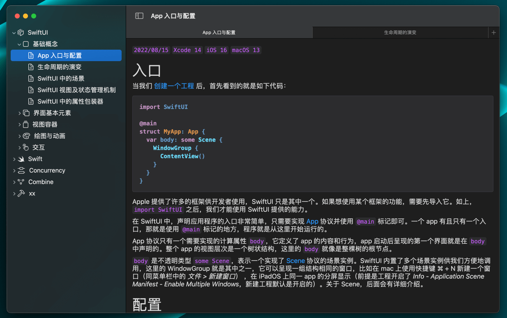
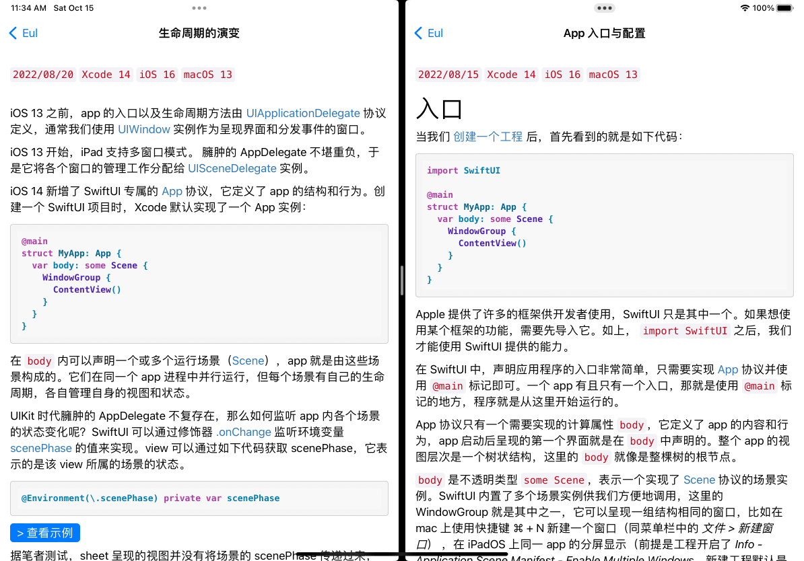
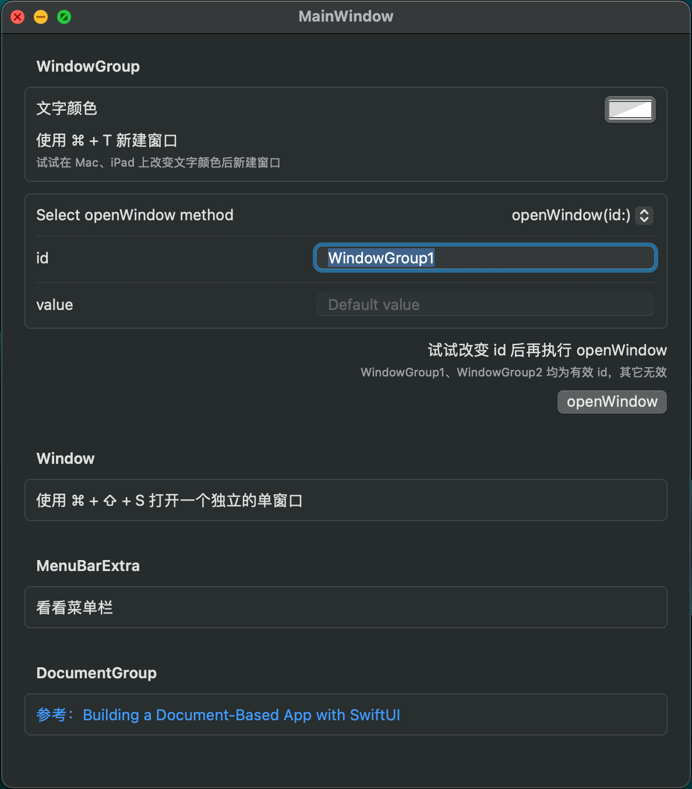

`2022/08/29`  `Xcode 14`  `iOS 16`  `macOS 13`  

*鉴于 Scene 比较特殊，难以在 Eul 中内置示例，笔者为其单独创建了一个样例工程，源码：[Eul/SampleScene](https://github.com/zzzwco/resources/tree/main/eul/SampleScene)。*

在《生命周期的演变》 中已经介绍过一些关于场景的概念了，下面逐一介绍 SwiftUI 内置的场景及其用法。

## [WindowGroup](https://developer.apple.com/documentation/swiftui/windowgroup?changes=latest_minor)

这是最重要、最常用的场景，新建一个 SwiftUI 工程时，在 app 入口处就会看到如下代码：

```swift
@main
struct MyAppApp: App {
  var body: some Scene {
    WindowGroup {
      ContentView()
    }
  }
}
```

WindowGroup 在不同的平台表现不一：在 iOS、watchOS 仅支持单窗口，iPadOS、macOS 支持多窗口。

比如在 Mac 下创建新窗口（系统默认快捷键为 ⌘ + N）：



在 iPad 中的多窗口界面：



在 app 入口处可以添加多个 scene，但只有第一个会被初始化并展示在界面上。比如示例中多个平台共用的 scene，在 app 启动后呈现的只有 MainWindow：

```swift
struct SharedScene: Scene {
  
  var body: some Scene {
    WindowGroup("MainWindow") {
      MainWindow()
    }
    #if os(macOS)
    // 设置窗口默认尺寸
    .defaultSize(width: 600, height: 1000)
    // 设置默认位置
    .defaultPosition(.center)
    // 系统默认快捷键为 ⌘ + N，这里设置为 ⌘ + T
    .keyboardShortcut("t", modifiers: [.command])
    #endif
    
    WindowGroup("WindowGroup1", id: "WindowGroup1", for: String.self) { $value in
      Text(value ?? "WindowGroup1 没有传值")
    }
    #if os(macOS)
    .keyboardShortcut("1", modifiers: [.command, .shift])
    #endif

    WindowGroup("WindowGroup2", id: "WindowGroup2", for: String.self) { $value in
      Text(value)
    } defaultValue: {
      "WindowGroup2 默认传值"
    }
    #if os(macOS)
    .keyboardShortcut("2", modifiers: [.command, .shift])
    #endif
  }
}
```

WindowGroup 有多个初始化方法，可以不添加任何参数直接通过闭包构建，也可以添加一至多个参数，具体就不一一例举了，读者可以对着苹果文档敲一遍。

上面的代码涉及到如下常用的参数：

- title：WindowGroup 的标题，支持字符串、本地化字符串、Text。
- id：WindowGroup 的身份标识，使用 openWindow 时会根据 id 找到对应的 WindowGroup，如果已经存在 value 相同的窗口，则会将其前置，如果没有，则新建窗口。
- for：遵循 Codable & Hashable 协议，即 WindowGroup 接收到的传值类型。
- $value：openWindow 通过环境变量传递过来的绑定值，其类型由 for 参数约束。
- defaultValue：如果传值为 nil，该闭包可以指定一个与 for 参数类型一致的默认值。

这里提到了 [openWindow](https://developer.apple.com/documentation/swiftui/environmentvalues/openwindow)，它其实是一个环境变量，在使用时先对其进行声明：

```swift
@Environment(\.openWindow) private var openWindow
```

然后，在需要的地方调用 openWindow 方法就可以打开在 app 入口处声明过的 WindowGroup 了。刚才提到 openWindow 是一个变量，为何又能以方法的形式进行调用呢？那是因为它实现了 callAsFunction 方法，希望进一步了解的可以参考：[SE-0253](https://github.com/apple/swift-evolution/blob/main/proposals/0253-callable.md)。

openWindow 有三个方法：

- openWindow(id:)
- openWindow(value:)
- openWindow(id:value:)

这里的 id 和 value 对应的就是 WindowGroup 的入参，只有数据类型保持一致，openWindow 才能正确地打开对应的 WindowGroup。

示例工程运行之后的界面如下，你可以根据以下两种操作来加深对 WindowGroup 的理解：

- 选择不同的方法和入参之后执行 openWindow。
- 直接使用快捷键 ⌘ + ⇧ + 1/2 分别打开 WindowGroup1 和 WindowGroup2。



另外，Xcode 新建的工程默认是支持多窗口的，如果要禁用 iPad 的多窗功能，可以 *Target > Info* 中设置 *Application Scene Manifest > Enable Multiple Windows* 为 *No*。

不过，这一做法对 Mac 是不生效的，但使用 Window 可以创建单窗口应用。

## [Window](https://developer.apple.com/documentation/swiftui/window?changes=latest_minor)

Window 只支持一个窗口，从命名上也很好区分它与 WindowGroup 的区别：

- WindowGroup 是一个组，它可以创建多个窗口，它们以标签页组的形式聚合在一起。
- Window 是一个独立的窗口，它无法创建新窗口。

由于 Window 在程序运行时是唯一的实例，系统就没有必要为其指定 id 以示身份了。这也是为什么 openWindow 只支持 WindowGroup 的原因，因为 WindowGroup 需要区分不同的窗口并向其传递变量。

那么如何打开 Window 呢？我们看看示例代码：

```swift
// Window > SingleWindow，或者使用快捷键 ⌘ + ⇧ + S
Window("SingleWindow", id: "SingleWindow") {
  Text("I'm a single, unque window.")
}
.keyboardShortcut("s", modifiers: [.command, .shift])
```

在 app 入口处声明 Window 实例后，程序运行后可以通过菜单栏中的 *Window > SingleWindow* 打开它。也可以为其指定快捷键，该快捷键也会显示在 *Window* 菜单中。

理解了 Window 之后，要创建一个单窗口的 mac 程序就非常简单了，只需要将 Window 实例声明为 app 的唯一场景即可。

## [Settings](https://developer.apple.com/documentation/swiftui/settings)

Settings 只能在 mac 上使用，用于打开程序的设置界面，⌘ + , 是默认快捷键。

它也是一个单独的窗口，从表象上看，其实就是一个特殊的 Window。

## [MenuBarExtra](https://developer.apple.com/documentation/swiftui/menubarextra)

MenuBarExtra 可以为程序在菜单栏中添加一个控件，支持 `.menu` 和 `.window` 两种样式。

如果想要创建一个只停留在 mac 菜单栏的 app，只需将 MenuBarExtra 实例作为 app 的唯一场景。不过，程序坞依然会出现 app 图标，此时需要在 *Info.plist* 中将属性 *Application is agent (UIElement)* 设置为 *YES*。

Settings 和 MenuBarExtra 的使用比较简单，这里就不展开来讲了，看看示例工程的运行效果和源码就可以明白。

## [DocumentGroup](https://developer.apple.com/documentation/swiftui/documentgroup?changes=latest_minor)

DocumentGroup 可以在多个平台上快速构建文件类型的场景界面，支持新建、打开、保存文件。

苹果官方有一个非常详细的样例，参考：[Building a Document-Based App with SwiftUI](https://developer.apple.com/documentation/swiftui/building_a_document-based_app_with_swiftui?changes=latest_minor)。

